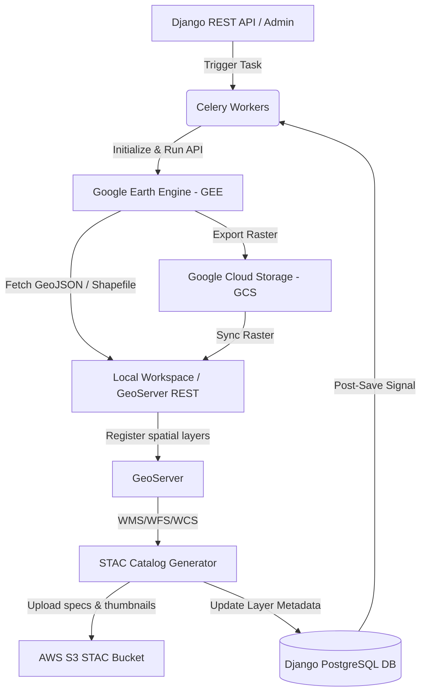

# Core Stack Backend - Computing System Calculations & Workflows

This document details the calculations, equations, and data-exchange workflows implemented across all folders and files within the [computing](file:///Users/snaveen/Desktop/Core-stack-backend/computing) directory.

---

## 1. System Architecture & Data Exchange Flow

The `computing` module coordinates spatial and hydrological analyses by integrating **Django**, **Celery**, **Google Earth Engine (GEE)**, **Google Cloud Storage (GCS)**, **GeoServer**, and **AWS S3**.

### Data Exchange Flow Details:

1. **Triggering**: A user or scheduler triggers a pipeline via Django views or API endpoints (`views.py` / `api.py`). Celery worker tasks execute the pipelines asynchronously.
2. **Computation (GEE)**: The Python GEE API logs in using credentials managed by the [GEEAccount](file:///Users/snaveen/Desktop/Core-stack-backend/computing/models.py) model. Spatial calculations are performed on GEE's cloud-hosted imagery and vector layers.
3. **Storage & Sync (GCS/GeoServer)**:
   - **Raster outputs** are exported from GEE to a GCS bucket, then imported to GeoServer via the GeoServer REST API.
   - **Vector outputs** are extracted directly via GEE `.getInfo()` or written locally as Shapefiles/GeoJSON and pushed to GeoServer using REST API helpers in [utils.py](file:///Users/snaveen/Desktop/Core-stack-backend/computing/utils.py).
4. **Metadata Recording**: Layers are registered in the Django database via the [Layer](file:///Users/snaveen/Desktop/Core-stack-backend/computing/models.py) model.
5. **STAC Spec & Metadata Aggregation**:
   - When `Layer.is_sync_to_geoserver` is set to `True`, a post-save signal in [signals.py](file:///Users/snaveen/Desktop/Core-stack-backend/computing/signals.py) triggers `generate_stac_collection_task`.
   - This task communicates with GeoServer via WCS (DescribeCoverage) for rasters or WFS (GetFeature) for vectors.
   - It extracts spatial bounds and band definitions, uses WMS to render a PNG thumbnail, builds STAC JSON metadata files, and uploads both to AWS S3.

---

## 2. Core Django Files

### [models.py](file:///Users/snaveen/Desktop/Core-stack-backend/computing/models.py)

Declares database schemas for:

- [Dataset](file:///Users/snaveen/Desktop/Core-stack-backend/computing/models.py#L12): Grouping configuration for spatial layers (vectors, rasters, points, customs) with GeoServer workspace and styling tags.
- [Layer](file:///Users/snaveen/Desktop/Core-stack-backend/computing/models.py#L34): Stores instances of computed spatial datasets clipped to a specific state, district, or block, tracking GEE asset paths, versioning, and GeoServer/STAC sync states.
- [LayerMapping](file:///Users/snaveen/Desktop/Core-stack-backend/computing/models.py#L74): Maps database layers to SpatioTemporal Asset Catalog (STAC) metadata parameters (bounding box templates, ee dataset names, styles) to automate Celery tasks.

### [signals.py](file:///Users/snaveen/Desktop/Core-stack-backend/computing/signals.py)

Listens to `post_save` signals on the [Layer](file:///Users/snaveen/Desktop/Core-stack-backend/computing/models.py#L34) model. If `is_sync_to_geoserver` is `True` and `is_stac_specs_generated` is `False`, it resolves the corresponding [LayerMapping](file:///Users/snaveen/Desktop/Core-stack-backend/computing/models.py#L74) and dispatches `generate_stac_collection_task` to the Celery worker queue `"nrm"`.

### [utils.py](file:///Users/snaveen/Desktop/Core-stack-backend/computing/utils.py)

Contains utility functions used across the module:

- `push_shape_to_geoserver` / `sync_layer_to_geoserver`: GeoServer REST integrations.
- `kml_to_geojson` / `convert_kml_to_shapefile`: Geoprocesses raw KML/KMZ user-submitted boundaries.
- `create_chunk` / `merge_chunks`: Splits large administrative boundaries into tiles during GEE processing to prevent out-of-memory errors, joining them back into a single asset post-computation.
- `save_layer_info_to_db` / `update_layer_sync_status`: Writes metadata to Django DB models.
- `safe_reduce_max`: Fetches spatial local maximums from GEE without error.

### [api.py](file:///Users/snaveen/Desktop/Core-stack-backend/computing/api.py) & [views.py](file:///Users/snaveen/Desktop/Core-stack-backend/computing/views.py)

Provide REST endpoints for:

- Initiating spatial calculation pipelines for custom years and coordinates.
- Fetching status of GEE batch tasks and Celery workers.
- Downloading generated metadata tables, GeoJSON layers, and STAC collections.

### [urls.py](file:///Users/snaveen/Desktop/Core-stack-backend/computing/urls.py)

Maps API views and viewsets to public and internal HTTP endpoints.

### [apps.py](file:///Users/snaveen/Desktop/Core-stack-backend/computing/apps.py)

Configures the Django application name and imports the signals module on startup.

### [tasks.py](file:///Users/snaveen/Desktop/Core-stack-backend/computing/tasks.py)

Defines basic Celery task wrappers.

### [tests.py](file:///Users/snaveen/Desktop/Core-stack-backend/computing/tests.py)

Contains scaffolding for unit tests.

### [path_constants.py](file:///Users/snaveen/Desktop/Core-stack-backend/computing/path_constants.py)

Stores GEE asset paths for India-wide administrative boundary and micro-watershed datasets (`India_mws_UID_Merged`).

---

## 3. Subdirectory Breakdown & Mathematical Calculations

---

### STAC_specs

Manages SpatioTemporal Asset Catalog metadata generation.

- **[stac_collection.py](file:///Users/snaveen/Desktop/Core-stack-backend/computing/STAC_specs/stac_collection.py)**: Contains the Celery task `generate_stac_collection_task`. It communicates with GeoServer via WCS (for rasters) or WFS (for vectors), fetches boundary envelopes, renders PNG thumbnails using WMS, compiles metadata CSVs, writes STAC catalog JSON files locally, and uploads them to S3.
- **[generate_STAC_layerwise.py](file:///Users/snaveen/Desktop/Core-stack-backend/computing/STAC_specs/generate_STAC_layerwise.py)**: Generates metadata for single, individual layers.
- **[generate_STAC_layerwise_collection.py](file:///Users/snaveen/Desktop/Core-stack-backend/computing/STAC_specs/generate_STAC_layerwise_collection.py)**: Aggregates individual STAC items into a collection-level catalog.
- **[generate_STAC_layerwise_collection_without_reading_data.py](file:///Users/snaveen/Desktop/Core-stack-backend/computing/STAC_specs/generate_STAC_layerwise_collection_without_reading_data.py)**: Speeds up catalog generation by querying GeoServer capabilities instead of downloading layer components.
- **[generate_STAC_for_existing_layers.py](file:///Users/snaveen/Desktop/Core-stack-backend/computing/STAC_specs/generate_STAC_for_existing_layers.py)**: A database migration script that generates STAC entries for existing layers in the Django DB.
- **[constants.py](file:///Users/snaveen/Desktop/Core-stack-backend/computing/STAC_specs/constants.py)**: Static configurations (S3 URLs, bucket names, default styles).
- **[test_stac_collection.py](file:///Users/snaveen/Desktop/Core-stack-backend/computing/STAC_specs/test_stac_collection.py)**: Verifies catalog structures and S3 connection integrity.

---

### catchment_area

Calculates stream network variables.

- **[catchmentarea.py](file:///Users/snaveen/Desktop/Core-stack-backend/computing/catchment_area/catchmentarea.py)**: Runs `compute_max_stream_order_and_catchment_for_swb`. Loads GEE raster datasets `STREAM_ORDER_ASSET` (Strahler stream orders) and `CATCHMENT_AREA` (accumulated flow areas). It maps over a surface water body vector asset (`swb_layer_asset`) and uses `ee.Reducer.max()` at a 30m scale to extract:
  - `max_stream_order`: The maximum Strahler order intersecting the water body polygon.
  - `max_catchment_area`: The maximum catchment area in the water body polygon.

---

### change_detection

Compares temporal landcover maps to detect degradation, urbanization, and agricultural shifts.

- **[change_detection.py](file:///Users/snaveen/Desktop/Core-stack-backend/computing/change_detection/change_detection.py)**: Computes transitions between a historical average (the `mode` of the first 3 years of LULC maps) and a current average (the `mode` of the remaining years).
  - **Urbanization**: Built-up transitions are remapped as:
    - `1` (Built-up to Built-up)
    - `2` (Water/Tree/Bare to Built-up)
    - `3` (Scrub/Cropland to Built-up)
    - `4` (Fallow/Plantation to Built-up)
  - **Degradation**: Remaps LULC to isolate forest degradation transitions (where historical class was Forest/Trees):
    - `1` (Forest to Forest)
    - `2` (Forest to Built-up)
    - `3` (Forest to Bare/Fallow)
    - `4` (Forest to Scrub)
  - **Deforestation / Afforestation**: First runs temporal smoothing (`change_deforestation_afforestation`) using a 3-year sliding window to remove classification noise, then computes:
    - Deforestation: Forest (Class 3) changing to Built-up (`2`), Cropland (`3`), Bare/Fallow (`4`), or Scrub (`5`).
    - Afforestation: Non-forest classes changing to Forest (Class 3).
  - **Cropping Intensity**: Monitors crop class transitions:
    - Double to Single (`1`), Triple to Single (`2`), Triple to Double (`3`), Single to Double (`4`), Single to Triple (`5`), Double to Triple (`6`), and stable single (`7`), double (`8`), and triple (`9`).
- **[change_detection_vector.py](file:///Users/snaveen/Desktop/Core-stack-backend/computing/change_detection/change_detection_vector.py)**: Converts transition rasters into vector area statistics per micro-watershed.
  - Using GEE `reduceRegions` with `ee.Reducer.sum()`, it sums the pixel area ($10\text{m} \times 10\text{m}$) where specific transition masks apply:
    $$
    \text{Area (ha)} = \text{Sum of pixel areas (m}^2\text{)} \times 0.0001
    $$

---

### clart

Composite Land Assessment and Restoration Tool for choosing soil and water conservation structures.

- **[clart.py](file:///Users/snaveen/Desktop/Core-stack-backend/computing/clart/clart.py)**: Performs raster overlay logic:
  1. **Slope Percentage ($SP$)**: Derived from SRTM elevation model. Converts slope in degrees ($\theta$) to percentage:
     $$
     SP = \tan\left(\theta \times \frac{\pi}{180}\right) \times 100
     $$
  2. **Lineaments**: Extracted from lineament raster (value `10` if present, `1` if absent).
  3. **Drainage Density ($DD$)**: Normalized between 0 and 1:
     $$
     DD_{norm} = \frac{DD - DD_{min}}{DD_{max} - DD_{min}}
     $$

     Binned into scores: `1` (if $DD_{norm} \le 0.334$), `2` (if $0.334 < DD_{norm} \le 0.667$), and `3` (if $DD_{norm} > 0.667$).
  4. **Recharge Potential ($RP$)**:
     $$
     RP = DD_{score} \times Lineament_{score} \times Lithology_{score}
     $$

     Classified into high (`1`), medium (`2`), low (`3`), or unsuitable (`0`) classes based on product ranges.
  5. **Suitability Classes**: Combines Recharge Potential ($RP$) and maximum slope ($SP_{max}$) limits:
     - **Class 1 (Recharge Shaft)**: $RP == 1$ and $0 \le SP \le 0.20 \times SP_{max}$
     - **Class 2 (Percolation Tank)**: $RP == 2$ and $0 \le SP \le 0.25 \times SP_{max}$
     - **Class 3 (Gully Plug)**: $RP == 3$ and $0 \le SP \le 0.20 \times SP_{max}$
     - **Class 4 (Contour Trench / Bunding)**: $RP \in \{1, 2, 3\}$ and $0.25 \times SP_{max} \le SP \le 0.30 \times SP_{max}$
     - **Class 5 (Afforestation / Unsuitable)**: $RP \in \{1, 2, 3\}$ and $SP > 0.30 \times SP_{max}$
- **[lithology.py](file:///Users/snaveen/Desktop/Core-stack-backend/computing/clart/lithology.py)**: Clips state lithology shapefiles against aquifer boundaries. Performs fuzzy string matching to look up aquifer parameters and assign a `Lithology_Class` based on its Recharge Infiltration Factor ($RIF$):
  - Class = 3 if RIF < 10 (Poor Recharge)
  - Class = 2 if $10 \le RIF \le 15$ (Medium Recharge)
  - Class = 1 if RIF > 15 (Good Recharge)
- **[drainage_density.py](file:///Users/snaveen/Desktop/Core-stack-backend/computing/clart/drainage_density.py)**: Calculates the drainage line length per unit area.
- **[rasterize_vector.py](file:///Users/snaveen/Desktop/Core-stack-backend/computing/clart/rasterize_vector.py)**: Rasterizes lithology and aquifer vector layers to 30m GEE images.
- **[fes_clart_to_geoserver.py](file:///Users/snaveen/Desktop/Core-stack-backend/computing/clart/fes_clart_to_geoserver.py)**: Handles manual overrides of CLART layers using external partner GeoTIFFs.

---

### crop_grid

Generates 16-hectare cropland tracking grids.

- **[crop_grid.py](file:///Users/snaveen/Desktop/Core-stack-backend/computing/crop_grid/crop_grid.py)**: Divides the block administrative bounding box into a grid of 16-hectare cells ($0.004^\circ$ scale). It keeps a grid cell if:
  - The cell lies entirely inside the block boundary, OR
  - The intersection area of the cell with the block polygon is $\ge 30\%$ (`cover_frac = 0.3`).
- **[crop_gridXlulc.py](file:///Users/snaveen/Desktop/Core-stack-backend/computing/crop_grid/crop_gridXlulc.py)**: Filters grid cells based on agricultural activity. Calculates the fraction of each cell covered by cropland classes (Single Kharif `9.0`, Single Non-Kharif `10.0`, Double `11.0`, and Triple `12.0` in the mode of the target LULC year):
  $$
  \text{Cropland Fraction} = \text{Frac}_{SingleKharif} + \text{Frac}_{SingleNonKharif} + \text{Frac}_{Double} + \text{Frac}_{Triple}
  $$

  Cells are retained in GEE only if the $\text{Cropland Fraction} > 0.4$ (40%).

---

### cropping_intensity

Tracks cropping patterns and agricultural efficiency.

- **[cropping_intensity.py](file:///Users/snaveen/Desktop/Core-stack-backend/computing/cropping_intensity/cropping_intensity.py)**:
  1. Computes the area (in hectares) of crop classes per year:
     - single_kharif_cropped_area (LULC class 8)
     - single_non_kharif_cropped_area (LULC class 9)
     - doubly_cropped_area (LULC class 10)
     - triply_cropped_area (LULC class 11)
  2. Calculates the union of all croplands from the baseline year (2017) to the target year to identify the maximum historical cropland footprint:
     $$
     \text{croppable\_area\_all\_years} = \bigvee_{\text{year}=2017}^{\text{end}} (\text{LULC}(\text{year}) \in \{8, 9, 10, 11\})
     $$

     This area is saved as `total_cropable_area_ever_hydroyear_2017_{end_year}`.
  3. Computes the Cropping Intensity ($CI$) index:
     - Calculates the area fractions:

       $$
       \text{sngl\_frac} = \frac{\text{single\_cropped\_area}}{\text{total\_croppable\_area}}
       $$

       $$
       \text{dbl\_frac} = \frac{\text{doubly\_cropped\_area}}{\text{total\_croppable\_area}}
       $$

       $$
       \text{trpl\_frac} = \frac{\text{triply\_cropped\_area}}{\text{total\_croppable\_area}}
       $$
     - Computes the weighted index:

       $$
       CI = \text{sngl\_frac} + 2 \times \text{dbl\_frac} + 3 \times \text{trpl\_frac}
       $$

---

### drought

Computes meteorological, agricultural, and vegetative drought indices.

- **[drought.py](file:///Users/snaveen/Desktop/Core-stack-backend/computing/drought/drought.py)**: The task entry point. Coordinates chunk-based extraction to prevent memory limits, runs `generate_drought_yearly`, merges yearly assets, and syncs them to GeoServer.
- **[generate_layers.py](file:///Users/snaveen/Desktop/Core-stack-backend/computing/drought/generate_layers.py)**: Calculates weekly and yearly drought indices:
  1. **Standardized Precipitation Index (SPI-1)**: Sourced from CHIRPS precipitation data over a rolling 28-day window:
     $$
     SPI = \frac{P_{28} - \mu_{28}}{\sigma_{28}}
     $$

     where $\mu_{28}$ is the long-term mean and $\sigma_{28}$ is the long-term standard deviation for that 28-day window from 1981 to the previous year.
  2. **Vegetation Condition Index (VCI)**: Sourced from MODIS NDVI:
     $$
     VCI = \frac{NDVI - NDVI_{min}}{NDVI_{max} - NDVI_{min}} \times 100
     $$

     Classified as: Severe ($\le 40\%$, score 3), Moderate ($40 < VCI \le 60\%$, score 2), or Normal ($> 60\%$, score 1).
  3. **Moisture Availability Index (MAI)**: Sourced from FLDAS evapotranspiration ($ET$) and potential evapotranspiration ($PET$):
     $$
     MAI = \frac{ET}{PET} \times 100
     $$

     Classified as: Severe ($\le 25\%$, score 3), Moderate ($25 < MAI \le 50\%$, score 2), or Mild/Normal ($> 50\%$, score 1).
  4. **Percentage of Area Sown (PAS)**:
     $$
     PAS = \frac{\text{Kharif Cropped Area}}{\text{Total Croppable Area}} \times 100
     $$

     Classified as: Severe ($\le 33.3\%$, score 3), Moderate ($33.3 < PAS \le 50\%$, score 2), or Normal ($> 50\%$, score 1).
  5. **Meteorological Drought Trigger ($mD$)**:
     - Evaluated based on rainfall deviation and dry spells:
       - If Normal rainfall or $SPI > -1$: $mD = 1$ if there is a Dry Spell, else `0`.
       - If Deficit/Scanty rainfall or $SPI \le -1$: $mD = 1$ if there is a Dry Spell. If no dry spell, $mD = 1$ only if rainfall is scanty or $SPI < -1.5$, else `0`.
- **[drought_causality.py](file:///Users/snaveen/Desktop/Core-stack-backend/computing/drought/drought_causality.py)**: Performs weekly causal pathway analysis. Traces how meteorological triggers ($mD == 1$) correspond to agricultural and vegetative classes (VCI, MAI, PAS) inside each watershed:
  - **Severe Drought Paths**: Triggered when VCI, MAI, and PAS classes are all classified as severe under meteorological drought (Path 1 for dry spells, Path 2 for scanty rainfall, Path 3 for low SPI).
  - **Moderate Drought Paths (Paths 4 to 18)**: Triggered when different combinations of severe, moderate, and mild classes occur.
  - **Mild Drought Paths**: Increments score contributions for dry spells, rainfall deviations, and SPI.
- **[merge_layers.py](file:///Users/snaveen/Desktop/Core-stack-backend/computing/drought/merge_layers.py)**: Merges weekly and chunked drought indices into annual datasets.

---

### layer_dependency

Handles pipeline execution orders.

- **[layer_generation_in_order.py](file:///Users/snaveen/Desktop/Core-stack-backend/computing/layer_dependency/layer_generation_in_order.py)**: Parses `layer_map.json` and `end_year_rules.json` to resolve dependencies. It sequentially triggers Celery tasks in parent-child configurations (e.g. `mws_layer` $\rightarrow$ `clip_lulc_v3` $\rightarrow$ `cropping_intensity`). It queries the Django database via the [DependencyValidator](file:///Users/snaveen/Desktop/Core-stack-backend/computing/layer_dependency/layer_generation_in_order.py#L187) class to verify that parent layers exist before starting child pipelines.

---

### lulc

Processes Land Use/Land Cover datasets.

- **[lulc_v3.py](file:///Users/snaveen/Desktop/Core-stack-backend/computing/lulc/lulc_v3.py)**: Clips national 10m LULC maps (`PAN_INDIA_RIVER_BASIN_LULC_V3_BASE_PATH`) to block boundaries. It saves three metadata datasets in the database (`LULC_level_1`, `LULC_level_2`, `LULC_level_3`) and syncs them to GeoServer with custom styles.
- **[lulc_vector.py](file:///Users/snaveen/Desktop/Core-stack-backend/computing/lulc/lulc_vector.py)**: Sums the areas of 12 landcover classes within each micro-watershed using GEE `reduceRegions`:
  $$
  \text{Area (ha)} = \frac{\text{Sum of pixel areas (m}^2\text{)}}{10000}
  $$
- **[cropping_frequency.py](file:///Users/snaveen/Desktop/Core-stack-backend/computing/lulc/cropping_frequency.py)**: Calculates how often a pixel is classified as cropland over a multi-year baseline.
- **[misc.py](file:///Users/snaveen/Desktop/Core-stack-backend/computing/lulc/misc.py)**: Contains helper utilities.
- **[utils/](file:///Users/snaveen/Desktop/Core-stack-backend/computing/lulc/utils)**:
  - `built_up.py`, `cropland.py`, `water_body.py`: Extract specific class masks.
  - `temporal_correction.py`: Smooths out classification noise (e.g., forest changing to cropland for one year and then back to forest).
- **[v4/](file:///Users/snaveen/Desktop/Core-stack-backend/computing/lulc/v4)**:
  - `lulc_v4.py` & `classify_raster.py`: Implements machine learning classifications (Random Forest) in GEE to generate 10m LULC v4 layers.
  - `create_classifier.py`: Trains GEE classifiers using landcover training points.
  - `farm_boundaries_clustering.py`: Clusters agricultural plots using SNIC segmentation.
- **[tehsil_level/](file:///Users/snaveen/Desktop/Core-stack-backend/computing/lulc/tehsil_level)** & **[river_basin_lulc/](file:///Users/snaveen/Desktop/Core-stack-backend/computing/lulc/river_basin_lulc)**: Historic sub-block and river-basin level clipping scripts.

---

### lulc_X_terrain

Intersects landcover and topographic datasets to classify landscapes.

- **[terrain_classifier.py](file:///Users/snaveen/Desktop/Core-stack-backend/computing/lulc_X_terrain/terrain_classifier.py)**: Calculates standardized TPI at small (5-10 pixel radii) and large (62-67 pixel radii) scales. It classifies cells into 11 landform classes based on slope, $TPI_{small}$, and $TPI_{large}$. These 11 classes are grouped into 5 landforms: Slopy, Plains, Ridge, Valley, and Steep Slopes. It calculates the area proportions of these 5 landforms in each MWS and assigns the watershed to one of 4 predefined cluster centroids:
  $$
  D_k = \sum_{j=1}^5 (Centroid_{k,j} - Proportion_j)^2
  $$
- **[lulc_on_plain_cluster.py](file:///Users/snaveen/Desktop/Core-stack-backend/computing/lulc_X_terrain/lulc_on_plain_cluster.py)**: For plain-dominated watersheds (where the terrain cluster is not 2), it calculates the proportions of cropland classes (barren, single crop, double crop, triple crop, forest, shrubs) on plains, calculates a 7-dimensional feature vector, and assigns the watershed to an Agroecological Zone (AEZ) level 2 plain cluster.
- **[lulc_on_slope_cluster.py](file:///Users/snaveen/Desktop/Core-stack-backend/computing/lulc_X_terrain/lulc_on_slope_cluster.py)**: Performs the same L2 clustering for slope-dominated watersheds (terrain cluster == 2) using slope cluster centroids.
- **[utils.py](file:///Users/snaveen/Desktop/Core-stack-backend/computing/lulc_X_terrain/utils.py)**: Centroids mapping and mathematical utility functions.

---

### management/commands

Django administrative CLI operations.

- **[generate_stac.py](file:///Users/snaveen/Desktop/Core-stack-backend/computing/management/commands/generate_stac.py)**: Triggers the STAC catalog generation pipeline for a specific block and layer type.
- **[check_stac_missing_layers.py](file:///Users/snaveen/Desktop/Core-stack-backend/computing/management/commands/check_stac_missing_layers.py)**: Scans Django database layers and identifies layers missing STAC metadata.
- **[load_layer_mappings.py](file:///Users/snaveen/Desktop/Core-stack-backend/computing/management/commands/load_layer_mappings.py)**: Populates the [LayerMapping](file:///Users/snaveen/Desktop/Core-stack-backend/computing/models.py#L74) database table from a source CSV metadata file.
- **[stac_coverage.py](file:///Users/snaveen/Desktop/Core-stack-backend/computing/management/commands/stac_coverage.py)**: Generates reports on cataloged STAC items.

---

### mws

Calculates hydrological water balances and cumulative groundwater storage.

- **[precipitation.py](file:///Users/snaveen/Desktop/Core-stack-backend/computing/mws/precipitation.py)**: Extracts cumulative precipitation per watershed over fortnight or annual windows using CHIRPS daily data.
- **[evapotranspiration.py](file:///Users/snaveen/Desktop/Core-stack-backend/computing/mws/evapotranspiration.py)**: Extracts cumulative actual evapotranspiration ($ET$) using FLDAS daily imagery.
- **[run_off.py](file:///Users/snaveen/Desktop/Core-stack-backend/computing/mws/run_off.py)**: Implements the USDA Soil Conservation Service (SCS) Curve Number method, adjusted for local slope ($\theta_{rad}$) and daily 5-day antecedent precipitation ($P5$) from JAXA data:
  1. Computes AMC-III Curve Number ($CN3$):
     $$
     CN3 = CN2 \times e^{0.00673 \times (100 - CN2)}
     $$
  2. Standardizes CN for slope ($CN2a$):
     $$
     CN2a = \left(\frac{CN3 - CN2}{3}\right) \times \left(1 - 2 e^{-13.86 \times \theta_{rad}}\right) + CN2
     $$
  3. Computes retention capacities for dry ($S_1$), normal ($S_2$), and wet ($S_3$) conditions:
     $$
     S_1 = \frac{25400}{CN1a} - 254; \quad S_2 = \frac{25400}{CN2a} - 254; \quad S_3 = \frac{25400}{CN3a} - 254
     $$
  4. Calculates daily runoff $Q$:
     - AMC I (Dry: $P5 \le 35\text{ mm}$):
       $$
       Q = \frac{(P - 0.2 S_1) \times (P - 0.2 S_1 + m_1)}{P + 0.8 S_1 + m_1} \quad (\text{if } P \ge 0.2 S_1, \text{ else } 0)
       $$
     - AMC II (Normal: $35 < P5 \le 52.5\text{ mm}$):
       $$
       Q = \frac{(P - 0.2 S_2) \times (P - 0.2 S_2 + m_2)}{P + 0.8 S_2 + m_2} \quad (\text{if } P \ge 0.2 S_2, \text{ else } 0)
       $$
     - AMC III (Wet: $P5 > 52.5\text{ mm}$):
       $$
       Q = \frac{(P - 0.2 S_3) \times (P - 0.2 S_3 + m_3)}{P + 0.8 S_3 + m_3} \quad (\text{if } P \ge 0.2 S_3, \text{ else } 0)
       $$

     where $m_i = 0.5 \times \left(-S_i + \sqrt{S_i^2 + 4 \times P \times S_i}\right)$.
  5. Sums daily runoff, integrates across the pixel grid area ($30\text{m} \times 30\text{m}$), and normalizes by the watershed area to return the average runoff depth.
- **[delta_g.py](file:///Users/snaveen/Desktop/Core-stack-backend/computing/mws/delta_g.py)**: Combines precipitation ($P$), runoff ($Q$), and evapotranspiration ($ET$) to calculate the water storage change ($\Delta G$):
  $$
  \Delta G = P - Q - ET
  $$
- **[calculateG.py](file:///Users/snaveen/Desktop/Core-stack-backend/computing/mws/calculateG.py)**: Sequentially computes cumulative groundwater storage ($G_t$):
  $$
  G_t = G_{t-1} + \Delta G_t
  $$

  If GEE asset size limits are exceeded, it writes a shapefile locally to [MERGE_MWS_PATH](file:///Users/snaveen/Desktop/Core-stack-backend/computing/mws/calculateG.py#L7) and uploads it using CLI utilities.
- **[generate_hydrology.py](file:///Users/snaveen/Desktop/Core-stack-backend/computing/mws/generate_hydrology.py)**: Orchestrates the calculation of precipitation, evapotranspiration, runoff, delta_g, and G, then updates the database.
- **[mws.py](file:///Users/snaveen/Desktop/Core-stack-backend/computing/mws/mws.py)**: Clips national micro-watershed boundaries to block geometries. (Contains commented code that dissolves small watersheds (<500 ha) into downstream neighbors using flow directions).
- **[mws_centroid.py](file:///Users/snaveen/Desktop/Core-stack-backend/computing/mws/mws_centroid.py)**: Extracts centroids of watersheds.
- **[mws_connectivity.py](file:///Users/snaveen/Desktop/Core-stack-backend/computing/mws/mws_connectivity.py)**: Builds upstream-downstream adjacency graphs.
- **[well_depth.py](file:///Users/snaveen/Desktop/Core-stack-backend/computing/mws/well_depth.py)**: Interpolates CGWB well depth data.
- **[net_value.py](file:///Users/snaveen/Desktop/Core-stack-backend/computing/mws/net_value.py)**: Estimates groundwater values.
- **[utils.py](file:///Users/snaveen/Desktop/Core-stack-backend/computing/mws/utils.py)**: Local date parsing utilities.

---

### plantation

Models site suitability for afforestation projects.

- **[site_suitability.py](file:///Users/snaveen/Desktop/Core-stack-backend/computing/plantation/site_suitability.py)**: Task entry point. Exports plantation boundary KMLs to GEE, runs `check_site_suitability`, and syncs vectors to GeoServer.
- **[site_suitability_raster.py](file:///Users/snaveen/Desktop/Core-stack-backend/computing/plantation/site_suitability_raster.py)**: Performs multi-criteria raster overlay analysis. Combines climate, soil, topography, ecology, and socioeconomic indices using weights defined in the [PlantationProfile](file:///Users/snaveen/Desktop/Core-stack-backend/computing/plantation/site_suitability_raster.py#L3):
  $$
  FinalScore = W_C \times Climate + W_S \times Soil + W_T \times Topography + W_E \times Ecology + W_{SE} \times Socioeconomic
  $$

  It masks out built-up, water bodies, and dense forest areas, exporting the suitability index as a raster GEE asset.
- **[site_suitability_vector.py](file:///Users/snaveen/Desktop/Core-stack-backend/computing/plantation/site_suitability_vector.py)**: Clips the suitability raster to site polygons, calculates the average score (`patch_average`), maps it to suitability labels (Very Good, Good, Moderate, Marginally Suitable, Unsuitable), and adds historical NDVI, LULC, and soil/terrain attributes to the shapefile features.
- **[utils/](file:///Users/snaveen/Desktop/Core-stack-backend/computing/plantation/utils)**:
  - `site_properties.py`: Extracts average slope, elevation, and aspect.
  - `ndvi_attachment.py` & `harmonized_ndvi.py`: Extracts and harmonizes historical NDVI curves.
  - `lulc_attachment.py`: Appends recent LULC classes.
  - `process_profile.py` & `plantation_utils.py`: Profile loading utilities.

---

### surface_water_bodies

Extracts and monitors surface water bodies.

- **[swb.py](file:///Users/snaveen/Desktop/Core-stack-backend/computing/surface_water_bodies/swb.py)**: Coordinates the 4-step surface water bodies pipeline:
  1. **SWB1 ([swb1.py](file:///Users/snaveen/Desktop/Core-stack-backend/computing/surface_water_bodies/swb1.py))**: Extracts and vectorizes LULC water pixels (classes 2, 3, 4).
  2. **SWB2 ([swb2.py](file:///Users/snaveen/Desktop/Core-stack-backend/computing/surface_water_bodies/swb2.py))**: Intersects water body geometries with micro-watershed boundaries to assign local identifiers.
  3. **SWB3 ([swb3.py](file:///Users/snaveen/Desktop/Core-stack-backend/computing/surface_water_bodies/swb3.py))**: Enriches water body features with catchment area, stream order, and buffer classifications.
  4. **SWB4 ([swb4.py](file:///Users/snaveen/Desktop/Core-stack-backend/computing/surface_water_bodies/swb4.py))**: Intersects water bodies with Water Body Census datasets to match registered census codes.
- **[merge_swb_ponds.py](file:///Users/snaveen/Desktop/Core-stack-backend/computing/surface_water_bodies/merge_swb_ponds.py)**: Dissolves overlapping water body polygons to avoid duplicate counts.

---

### terrain_descriptor

Prepares landform and elevation datasets.

- **[terrain_raster.py](file:///Users/snaveen/Desktop/Core-stack-backend/computing/terrain_descriptor/terrain_raster.py)**: Clips SRTM digital elevation models, computes slope and aspect layers, and uploads them to GEE.
- **[terrain_raster_fabdem.py](file:///Users/snaveen/Desktop/Core-stack-backend/computing/terrain_descriptor/terrain_raster_fabdem.py)**: Clips FABDEM elevation data (corrected for canopy/forest heights).
- **[terrain_clusters.py](file:///Users/snaveen/Desktop/Core-stack-backend/computing/terrain_descriptor/terrain_clusters.py)**: Runs the 11-class landform TPI classification at block scale.
- **[terrain_utils.py](file:///Users/snaveen/Desktop/Core-stack-backend/computing/terrain_descriptor/terrain_utils.py)**: General helper utilities for slope and aspects.

---

### tree_health

Analyzes tree canopy heights and canopy cover densities.

- **[canopy_height.py](file:///Users/snaveen/Desktop/Core-stack-backend/computing/tree_health/canopy_height.py)**: Clips GEDI/Sentinel canopy height collections (`CH_RASTER`). It applies a GEE mask:
  $$
  \text{Mask} = \text{LULC} == 6 \quad (\text{Class 6 = Tree/Forest})
  $$

  This restricts canopy height calculations to tree-covered pixels.
- **[ccd.py](file:///Users/snaveen/Desktop/Core-stack-backend/computing/tree_health/ccd.py)**: Performs the same LULC masking on GEE Canopy Cover Density (`CCD_RASTER`) layers.
- **[overall_change.py](file:///Users/snaveen/Desktop/Core-stack-backend/computing/tree_health/overall_change.py)**: Combines pre-calculated tree changes with LULC deforestation and afforestation maps:
  1. Sets a background class value of `-9999`.
  2. If `afforestation == 1` (Forest remained Forest), maps value to `0` (Stable).
  3. If `deforestation` is between 2 and 5 (loss of forest), maps value to `-2` (Tree cover loss).
  4. If `afforestation` is between 2 and 5 (gain of forest), maps value to `2` (Tree cover gain).
  5. Within stable forest pixels, it overlays detailed canopy change classes (degradation `-1`, partial degradation `3`/`4`, improvement `1`).
  6. Masks out the background code (`-9999`).
- **[canopy_height_vector.py](file:///Users/snaveen/Desktop/Core-stack-backend/computing/tree_health/canopy_height_vector.py)**, **[ccd_vector.py](file:///Users/snaveen/Desktop/Core-stack-backend/computing/tree_health/ccd_vector.py)**, & **[overall_change_vector.py](file:///Users/snaveen/Desktop/Core-stack-backend/computing/tree_health/overall_change_vector.py)**:
  Run spatial reducers over the respective rasters to calculate average canopy height, cover density, and pixel counts of change classes in each micro-watershed polygon.

---

### water_rejuvenation

Analyzes the impact of check dams and water harvesting structures.

- **[water_rejuventation.py](file:///Users/snaveen/Desktop/Core-stack-backend/computing/water_rejuvenation/water_rejuventation.py)**:
  1. **`find_closest_water_pixel`**: If a check dam lat/lon is not on a water pixel, it buffers the point by 1500m, applies a fast distance transform to water pixels, and identifies the coordinates of the closest water pixel.
  2. **`compute_metrics`**: Calculates actual evapotranspiration ($ET$) and potential evapotranspiration ($PET$) to compute NDMI (Normalized Difference Moisture Index) from Landsat 8 TOA bands B5 (NIR) and B6 (SWIR-1):
     $$
     NDMI = \frac{B5 - B6}{B5 + B6}
     $$

     It masks NDMI to include only cropland pixels (8, 9, 10, 11) that are downstream (elevation < structure elevation). It then calculates the average NDMI and pixel count inside 50m-wide rings from 100m to 1500m.
  3. **`generate_zoi_asset_on_gee`**: Fits an 8th-degree polynomial regression to the NDMI vs distance curve using GEE:
     $$
     \text{NDMI}(d) = \beta_0 + \beta_1 d + \beta_2 d^2 + \dots + \beta_8 d^8
     $$

     It identifies the Zone of Influence (ZOI) boundary radius where the agricultural moisture contribution levels off, exports the ZOI circles, and syncs them to GeoServer.

---

### zoi_layers

Delineates Zones of Influence (ZOI) around water bodies.

- **[zoi.py](file:///Users/snaveen/Desktop/Core-stack-backend/computing/zoi_layers/zoi.py)**: Celery task entry point. Triggers ZOI boundary, ZOI cropping intensity, and ZOI NDVI generation.
- **[zoi1.py](file:///Users/snaveen/Desktop/Core-stack-backend/computing/zoi_layers/zoi1.py)**: Calculates the ZOI radius ($ZOI_{wb}$ in meters) around a water body centroid based on its surface area ($x$ in hectares):
  - Computes logistic weight $s$ (centered at $0.2\text{ ha}$):

    $$
    s(x) = \frac{1}{1 + e^{-50 \times (x - 0.2)}}
    $$
  - Computes radii for small and large water bodies:

    $$
    y_{small}(x) = 126.84 \times \ln(x + 0.05) + 383.57
    $$

    $$
    y_{large}(x) = 140 \times \ln(x + 0.05) + 500
    $$
  - Combines the values:

    $$
    ZOI_{wb} = (1 - s) \times y_{small}(x) + s \times y_{large}(x)
    $$
  - Generates circular buffers based on $ZOI_{wb}$ and exports them.
- **[zoi2.py](file:///Users/snaveen/Desktop/Core-stack-backend/computing/zoi_layers/zoi2.py)**: Runs the cropping intensity pipeline inside the ZOI circular buffers from 2017 to 2024 to trace agricultural changes.
- **[zoi3.py](file:///Users/snaveen/Desktop/Core-stack-backend/computing/zoi_layers/zoi3.py)**: Extracts historical NDVI curves for the ZOI circular buffers.
- **[zoi4.py](file:///Users/snaveen/Desktop/Core-stack-backend/computing/zoi_layers/zoi4.py)**: Extracts NDMI values for the ZOI circular buffers.

---

### misc

Auxiliary geoprocessing layers.

- **[admin_boundary.py](file:///Users/snaveen/Desktop/Core-stack-backend/computing/misc/admin_boundary.py)**: Clips national administrative boundary maps to create block boundaries.
- **[aquifer_vector.py](file:///Users/snaveen/Desktop/Core-stack-backend/computing/misc/aquifer_vector.py)**: Clips national principal aquifer shapefiles to block boundaries.
- **[catchment_area.py](file:///Users/snaveen/Desktop/Core-stack-backend/computing/misc/catchment_area.py)**: Generates flow accumulation and catchment area rasters using the Single Flow Direction (D8) algorithm.
- **[digital_elevation_model.py](file:///Users/snaveen/Desktop/Core-stack-backend/computing/misc/digital_elevation_model.py)**: Clips SRTM/FABDEM datasets to block boundaries.
- **[distancetonearestdrainage.py](file:///Users/snaveen/Desktop/Core-stack-backend/computing/misc/distancetonearestdrainage.py)**: Calculates Euclidean distance layers from the drainage/stream network.
- **[drainage_lines.py](file:///Users/snaveen/Desktop/Core-stack-backend/computing/misc/drainage_lines.py)**: Clips line geometries representing streams/rivers to block boundaries.
- **[facilities_proximity.py](file:///Users/snaveen/Desktop/Core-stack-backend/computing/misc/facilities_proximity.py)**: Computes buffer zones around local facilities and infrastructure.
- **[factory_csr.py](file:///Users/snaveen/Desktop/Core-stack-backend/computing/misc/factory_csr.py)**: Identifies candidate intervention zones near factories based on proximity buffers.
- **[green_credit.py](file:///Users/snaveen/Desktop/Core-stack-backend/computing/misc/green_credit.py)**: Identifies degraded grasslands or barren lands suitable for the Green Credit Scheme.
- **[hls_interpolated_ndvi.py](file:///Users/snaveen/Desktop/Core-stack-backend/computing/misc/hls_interpolated_ndvi.py)**: Interpolates Harmonized Landsat Sentinel-2 (HLS) NDVI curves to fill cloud gaps.
- **[lcw_conflict.py](file:///Users/snaveen/Desktop/Core-stack-backend/computing/misc/lcw_conflict.py)**: Identifies intersections between linear infrastructure and wildlife corridor maps to flag corridors.
- **[mining_data.py](file:///Users/snaveen/Desktop/Core-stack-backend/computing/misc/mining_data.py)**: Clips and maps mine lease boundaries and active mining zones.
- **[naturaldepression.py](file:///Users/snaveen/Desktop/Core-stack-backend/computing/misc/naturaldepression.py)**: Identifies topographic sinks (natural depressions) that collect runoff.
- **[ndvi_time_series.py](file:///Users/snaveen/Desktop/Core-stack-backend/computing/misc/ndvi_time_series.py)**: Extracts multi-year historical NDVI curves for agricultural monitoring.
- **[nrega.py](file:///Users/snaveen/Desktop/Core-stack-backend/computing/misc/nrega.py)**: Clips point layers of historical NREGA public works project sites.
- **[restoration_opportunity.py](file:///Users/snaveen/Desktop/Core-stack-backend/computing/misc/restoration_opportunity.py)**: Identifies areas suitable for forest restoration.
- **[slope_percentage.py](file:///Users/snaveen/Desktop/Core-stack-backend/computing/misc/slope_percentage.py)**: Generates slope percentage layers from DEMs.
- **[soge_vector.py](file:///Users/snaveen/Desktop/Core-stack-backend/computing/misc/soge_vector.py)**: Clips soil organic carbon layers to map soil degradation.
- **[stream_order.py](file:///Users/snaveen/Desktop/Core-stack-backend/computing/misc/stream_order.py)**: Extracts drainage stream channels and assigns Strahler order vectors.
- **[canal_layer.py](file:///Users/snaveen/Desktop/Core-stack-backend/computing/misc/canal_layer.py)**: Clips local canal lines.
- **[antyodaya.py](file:///Users/snaveen/Desktop/Core-stack-backend/computing/misc/antyodaya.py)**: Joins socio-economic development survey parameters (Mission Antyodaya).
- **[internal_api_initialisation_test.py](file:///Users/snaveen/Desktop/Core-stack-backend/computing/misc/internal_api_initialisation_test.py)**: Diagnostic verification script.
