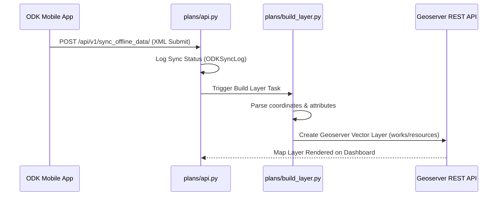
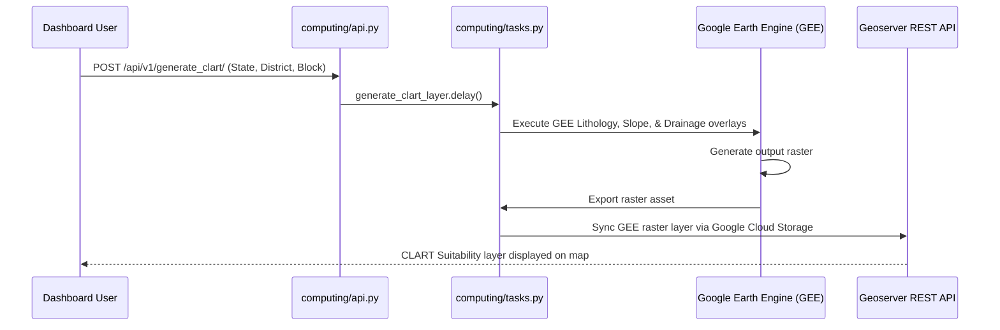

# CoRE Stack Backend: Comprehensive Directory, File, and Scientific Engine Documentation

This reference guide provides an in-depth breakdown of the directory structure, file configurations, linkages, data pipelines, and core scientific models implemented in the CoRE Stack backend.

---

## 📁 Part 1: File Tree & Folder Summaries

The following diagram illustrates the directory structure of the CoRE Stack Backend:

```
core-stack-backend/
│
├── nrm_app/                     # Core Django Configuration
│   ├── settings.py              # Global environment, credentials, and app listings
│   ├── urls.py                  # Project-wide route registry (Swagger, Django Admin)
│   ├── celery.py                # Celery worker configuration & initialization
│   └── api.py                   # Administrative hierarchy helper endpoints
│
├── geoadmin/                    # Administrative boundaries management
│   ├── models.py                # LGD and SOI boundary models (State, District, Block, GP)
│   ├── api.py                   # APIs for syncing boundary database tables
│   └── tasks.py                 # Async tasks for shapefile processing
│
├── computing/                   # GIS & Remote Sensing Computing Engines
│   ├── mws/                     # Hydrological calculations (P, ET, Q, DeltaG, Well Depth)
│   ├── drought/                 # Multi-indicator drought assessment algorithms
│   ├── clart/                   # Land treatment & structures recommendation engine
│   ├── cropping_intensity/      # Multi-seasonal agricultural cropping tracking
│   ├── surface_water_bodies/    # Pond & reservoir detection
│   ├── tree_health/             # CCD and canopy height processing
│   ├── api.py                   # DRF views triggering Celery compute tasks
│   └── urls.py                  # URLs mapping to computing endpoints
│
├── plans/                       # Field-level NRM planning & sync
│   ├── models.py                # ODKSyncLog, Plan, PlanApp
│   ├── api.py                   # Syncing offline mobile submissions
│   └── build_layer.py           # Builds Geoserver map layers from synced data
│
├── dpr/                         # Detailed Project Report generation
│   ├── gen_mws_report.py        # Individual Microwatershed PDF reports
│   ├── gen_tehsil_report.py     # Block/Tehsil summary reports
│   ├── gen_dpr.py               # DPR PDF/Excel builders
│   └── models.py                # Report generation track and metadata
│
├── users/                       # User management & ACL rules
│   ├── models.py                # Custom User & UserProjectGroup models
│   └── permissions.py           # Custom JWT and API key permission classes
│
├── utilities/                   # Cross-application utility helpers
│   └── constants.py             # Global GEE assets and ODK endpoints
│
├── installation/                # Setup & Verification helpers
│   ├── environment.yml          # Conda package manifest
│   ├── install.sh               # Shell pipeline script
│   └── public_api_client.py     # Independent standalone Python download helper
│
└── app-run.md                   # Local execution guide
```

---

## ⚙️ Part 2: Folder Summaries & File Purposes

### 1. `nrm_app/` (Django Core)

* **Purpose**: Manages global configuration, settings, database routers, and background tasks.
* **Files**:
  * `settings.py`: Resolves environment variables, handles AWS S3/GCS bucket credentials, lists registered Django apps, and configures databases (PostgreSQL/PostGIS) and logging.
  * `urls.py`: Maps HTTP routes. Mounts Swagger UI/Redoc for documentation, Django admin panel, and child app endpoints.
  * `celery.py`: Initializes the Celery system, enabling asynchronous execution of GEE scripts.

### 2. `geoadmin/` (Geographical Boundaries)

* **Purpose**: Provides structured geographical tables for spatial indexing and planning.
* **Files**:
  * `models.py`: Defines two distinct boundary mappings:
    1. **LGD (Local Government Directory)**: census classifications (`State`, `District`, `Block`).
    2. **SOI (Survey of India)**: topography boundaries (`StateSOI`, `DistrictSOI`, `TehsilSOI`, `GramPanchayat`).
  * `api.py`: Implements endpoints to query, load, and activate boundaries from shapefiles.

### 3. `computing/` (GEE Compute Pipelines)

* **Purpose**: Orchestrates and executes remote-sensing calculation pipelines.
* **Files**:
  * `api.py`: DRF endpoints that kick off Celery tasks.
  * `mws/`: Performs hydrology water budgeting (Precipitation, Runoff, Evapotranspiration, Well Depths).
  * `drought/`: Triggers calculations to identify dry spells, vegetation stress, and composite drought indicators.
  * `clart/`: Combines lineament, lithology, and slope layers to output structure recommendations.
  * `tree_health/`: Runs GEE scripts to calculate CCD and vegetation growth metrics.

### 4. `plans/` (NRM Planning & Synchronization)

* **Purpose**: Synchronizes ground-level NRM assets (both remote-sensed and proposed).
* **Files**:
  * `api.py`: Receives XML submissions from mobile planners, fetches ODK logs, and processes offline syncs.
  * `build_layer.py`: Parses CSV coordinates, connects to the Geoserver REST API, and uploads layers.

### 5. `dpr/` (Report Generators)

* **Purpose**: Generates engineering-grade documents and reports.
* **Files**:
  * `gen_mws_report.py` / `gen_tehsil_report.py`: Compiles local weather histories, crops, water resources, and proposed treatments into structured PDF/Excel sheets.
  * `gen_report_download.py`: Manages the background compilation of reports and uploads them to S3 buckets for download.

---

## 🔄 Part 3: Data Flows & Inter-File Linkages

### A. The NRM Planning & Execution Loop



### B. Scientific Compute Pipeline



---

## 🧮 Part 4: Scientific Models & Core Equations

### 1. Water Balance Model (Hydrology)

Calculates soil and aquifer recharge per Microwatershed (MWS) polygon.

* **Primary Equation**:

  $$
  \Delta G = P - Q - ET
  $$

  * $\Delta G$: Change in groundwater storage / soil moisture ($mm$).
  * $P$: Cumulative precipitation ($mm$), obtained from JAXA GSMaP satellite daily aggregates (`JAXA_PPT`).
  * $ET$: Cumulative Evapotranspiration ($mm$), computed from NASA FLDAS (`Evap_tavg`) by scaling water vapor flux rates:
    $$
    ET = Evap\_tavg \times 86400 \times \text{number of days}
    $$
  * $Q$: Surface runoff ($mm$), calculated using the **Slope-Adjusted SCS Curve Number Method**:
    $$
    Q = \frac{(P - 0.2S)^2}{P + 0.8S} \quad \text{for } P > 0.2S; \quad \text{else } Q = 0
    $$

    * **Curve Number ($CN$) Modification**: Base $CN_2$ (determined by intersecting Dynamic World `LULC` labels and `Hydrologic Soil Groups`) is adjusted for terrain slope ($sp$) derived from SRTM DEM elevation:
      $$
      CN_{2a} = (CN_3 - CN_2) \times [1 - 2e^{-13.86 \times sp}] + CN_2
      $$
    * **Soil Moisture Dynamic Check**: Curve Number is automatically switched to dry ($CN_{1a}$) or wet ($CN_{3a}$) based on the antecedent rainfall sum over the preceding 5 days ($P_5$).
* **Well Depth Fluctuation ($wd$)**:
  Projects the vertical movement of the local water table:

  $$
  wd = \frac{\Delta G}{S_y \times 1000}
  $$

  * $wd$: Vertical change in water table (meters).
  * $S_y$: Specific Yield of the underlying aquifer (retrieved from Central Ground Water Board - CGWB vector boundaries).

---

### 2. Composite Drought Assessment

Assesses agricultural and meteorological drought to guide disaster management.

* **Indicators Used**:
  1. **Standardized Precipitation Index (SPI-1)**: Quantifies rainfall deviation against long-term means and standard deviations (since 1981).
  2. **Vegetation Condition Index (VCI)**: Standardizes MODIS NDVI values inside crop masks relative to historical minimums and maximums (since 2000):
     $$
     VCI = \frac{NDVI - NDVI_{min}}{NDVI_{max} - NDVI_{min}} \times 100
     $$
  3. **Moisture Adequacy Index (MAI)**: Monitors agricultural crop moisture stress:
     $$
     MAI = \frac{Actual \ Evapotranspiration \ (ET)}{Potential \ Evapotranspiration \ (PET)}
     $$
  4. **Percent Area Sown (PAS)**: The ratio of active crop area currently cultivated to the maximum historical crop potential.
* **Classification Criteria**:
  * **Normal (0)**: No meteorological triggers.
  * **Mild (1)**: Meteorological triggers active, but crops show minimal stress.
  * **Moderate (2)**: $\ge 2$ agricultural indicators denote moderate stress (VCI $\le 60\%$, MAI $\le 50\%$, PAS $\le 50\%$).
  * **Severe (3)**: 3 indicators denote severe stress (VCI $\le 40\%$, MAI $\le 25\%$, PAS $\le 33.3\%$).

---

### 3. CLART (Composite Land Assessment and Restoration Tool)

Assesses topography and geology to suggest appropriate locations for NRM structures.

* **Equation for Recharge Potential ($rp$)**:
  $$
  rp = dd\_score \times lin\_score \times lith\_score
  $$

  * $dd\_score$: Drainage Density score (Low = 1, Med = 2, High = 3).
  * $lin\_score$: Lineament fracture density (Present = 10, Absent = 1).
  * $lith\_score$: Lithology score based on underlying rock permeability.
* **Class Recommendation Decision Rules**:
  * **Class 1 (Recharge Structures)**: High recharge potential ($rp \in \{1, 2, 10, 20, 30, 40, 60, 90\}$) & Flat slope ($\le 20\%$ of max). *Structures: check dams, recharge shafts, percolation ponds.*
  * **Class 2 (Surface Water Harvesting)**: Medium recharge potential ($rp \in \{3, 4\}$) & Gentle slope ($\le 25\%$). *Structures: farm ponds.*
  * **Class 3 (Biological/Vegetative measures)**: Low recharge potential ($rp \in \{6, 9\}$) & Flat slope ($\le 20\%$). *Structures: afforestation, vegetative barriers.*
  * **Class 4 (Contour Trenches)**: Sloped terrain ($25\% \le sp \le 30\%$). *Structures: continuous contour trenches.*
  * **Class 5 (Gully Plugs)**: Very steep terrain ($sp > 30\%$). *Structures: boulder checks, gully control blocks.*

---

## 📚 Part 5: Core Datasets & Reference Sources

| Dataset Name                       | GEE Asset ID / Path                                            | Primary Use                                          |
| ---------------------------------- | -------------------------------------------------------------- | ---------------------------------------------------- |
| **GSMaP (JAXA)**             | `JAXA/GPM_L3/GSMaP/v6/operational`                           | Hourly satellite rainfall rates                      |
| **FLDAS (NASA)**             | `projects/corestack-datasets-alpha/assets/datasets/ET_FLDAS` | Fortnightly & Annual Evapotranspiration              |
| **GLDAS (NASA)**             | `NASA/FLDAS/NOAH01/C/GL/M/V001`                              | Global land data assimilation                        |
| **Dynamic World (Google)**   | `GOOGLE/DYNAMICWORLD/V1`                                     | 10-meter deep-learning Land Cover                    |
| **SRTM DEM (USGS)**          | `USGS/SRTMGL1_003`                                           | Digital elevation and slope calculations             |
| **Hydrologic Soil Groups**   | `projects/ext-datasets/assets/datasets/HYSOGs250m`           | Hydrological Soil Group (A, B, C, D) classifications |
| **Principal Aquifer (CGWB)** | `projects/ext-datasets/assets/datasets/principalAquifer`     | Specific yield ($S_y$) vector map of India         |
| **Lineaments**               | `projects/ee-harshita-om/assets/india_lineaments`            | Structural fractures and faults in crust             |
| **FABDEM**                   | `projects/sat-io/open-datasets/FABDEM`                       | Forest/building-height corrected elevation           |
